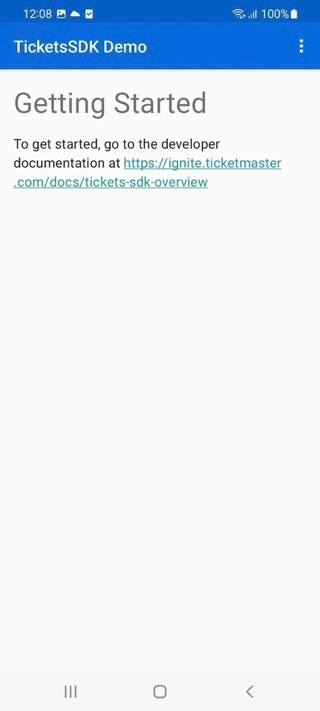
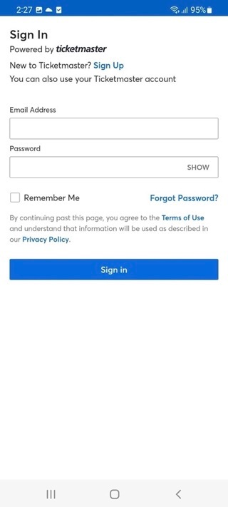
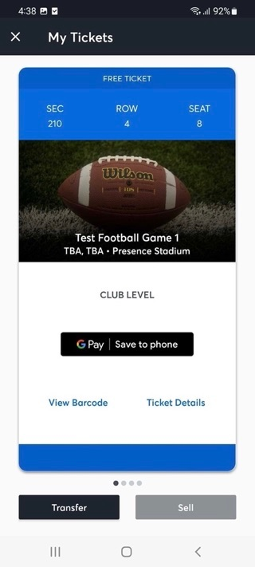

# Android Tickets SDK Application Integration Demo

This is an example integration of the Ticketmaster Ignite SDK, Tickets framework.

* Overview: https://business.ticketmaster.com/ignite/
* Documentation: https://ignite.ticketmaster.com/docs/tickets-sdk-overview
* Android Source (Tickets SDK): https://github.com/ticketmaster/Android-TicketsDemoApp
* iOS Source (Tickets SDK): https://github.com/ticketmaster/iOS-TicketsDemoApp

## Demo App Screenshots

   


## Getting Started
1. Open Android-TicketsDemoApp in Android Studio
   1. This will also download all the required libraries
2. Update `local.properties` with your own API key
   1. available from [https://developer.ticketmaster.com/explore/](https://developer.ticketmaster.com/explore/){target="_blank"}
3. Update your Team Name and colors:
```
config.consumer_key="consumer_key"
config.team_name="team_name"
config.branding_color="#color"
```
4. For Modern Accounts Login
   1. Open the `Android Manifest.xml` and add the following `ModernAccountsLoginScreen`:

```
<activity
    android:name="com.ticketmaster.authenticationsdk.internal.modernaccounts.presentation.ModernAccountsLoginScreen"
    android:screenOrientation="portrait"
    android:exported="true"
    android:launchMode="singleInstance">
    <intent-filter>
        <action android:name="android.intent.action.VIEW" />
        <category android:name="android.intent.category.DEFAULT" />
        <category android:name="android.intent.category.BROWSABLE" />
        <!-- YOUR SCHEME will be provided in your app settings, copy it to this location -->
        <data android:scheme="psdkscheme[client scheme name]" />
    </intent-filter>
</activity>
```

5. Optional
   If your app supports transfer tickets via SMS, you must add the following permission into your `Android Manifest.xml`
```
<uses-permission android:name="android.permission.SEND_SMS"/>
```

6. Build and Run

# Example Code

## Configuration
Update your API key, team name and branding colors in `local.properties`
Authentication SDK is configured using the settings in `local.properties`.
<br>
Tickets SDK inherits it's configuration from Authentication SDK

For Modern Accounts, add the `ModernAccountsLoginScreen` activity into the `AndroidManifest.xml` file and add inside your scheme.

## Presentation
There is one way to present the Tickets SDK:

* Generate the `EventsFragment` from `TicketsSDKClient` and add it to your view.

Basic example in `TicketsSDKHostActivity.kt`

## Authentication

While not required, your application may want to control login-related processes directly.
* **Login**
* **Member Info**
* **Logout**
  
Tickets SDK handles Login/Logout on it's own, so there is no need for you to manually call any of these methods.


## Information

While not required, your application may want to be informed of operations and use behavior with Authentication and Tickets SDKs.

This information is provided via delegate protocols, basic examples are provided.


## Custom Modules


While not required, your application may want to use Prebuilt Modules or even create your Custom Modules to display underneath the Tickets on the Tickets Listing page.